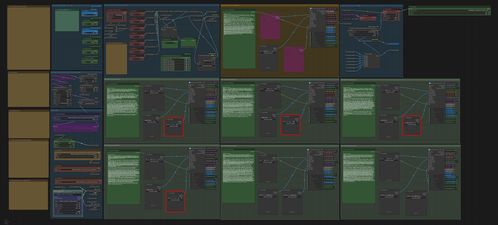

# MiniMax H3 R2V MusicVideo FaceRefine RTXVSR

ComfyUI workflow for **MiniMax H3 Reference-to-Video music video generation**.

This workflow is designed for creating longer music videos by generating up to **7 seamless clips per Part**, with Motion Context continuity, FaceRefine, automatic FaceRefine bypass, multiple MiniMax H3 acceleration configurations, audio synchronization, sparse-attention optimization, and RTX Video Super Resolution 2x upscaling.



---

## Features

- MiniMax H3 Reference-to-Video
- Up to 7 clips per Part
- Selectable number of clips
- Seamless Motion Context between clips
- Audio synchronization
- FaceRefine for face detail enhancement
- Automatic FaceRefine bypass when no face/person is detected
- PDD Acc 8-step support
- Fused Turbo 4-step support
- TaoMate 3-step LoRA support
- Model Sparse Attention optimization
- Model Attention Backend support (`comfy kitchen attention` / `pytorch attention`)
- Part-based long video generation
- RTX Video Super Resolution 2x upscaling
- Designed for practical use on approximately 12GB–16GB VRAM GPUs

---

# Workflow Overview

```text
Load Audio
   ↓
Clip 1 Pass1
   ↓
Motion Context
   ↓
Clip 2 Pass1
   ↓
Motion Context
   ↓
...
   ↓
Clip 7 Pass1
   ↓
VAE Decode
   ↓
FaceRefine
   ↓
Motion Context overlap trim
   ↓
Selected clips concatenated
   ↓
RTX Video Super Resolution 2x
   ↓
Save Part
```

Each generated group of clips is treated as one **Part**.

For longer music videos:

```text
Part 1
↓
Part 2
↓
Part 3
↓
...
↓
Merge Parts externally
↓
Final Music Video
```

---

# Workflow File

The workflow JSON included in this repository:

```text
MiniMax_H3_R2V_7clip_SEAMLESS_RTXVSR.json
```

Download the JSON and load it into ComfyUI.

---

# Required Custom Nodes

## Install with ComfyUI Manager

### rgthree-comfy

Repository:

```text
https://github.com/rgthree/rgthree-comfy
```

Used nodes:

- Any Switch
- Fast Groups Bypasser

---

### ComfyUI-KJNodes

Repository:

```text
https://github.com/kijai/ComfyUI-KJNodes
```

Used nodes include:

- GetNode / SetNode
- MiniMax H3 Chunk FeedForward
- Patch SageAttention *(alternative / comparison path)*
- MiniMax H3 Memory Efficient SageAttention Patch *(alternative / comparison path)*
- MiniMax H3 Low VRAM Attention *(alternative / comparison path)*

---

### ComfyUI Core Optimization Nodes

The workflow also uses ComfyUI core model-optimization nodes:

- Model Sparse Attention
- Model Attention Backend

Recommended current configuration:

```text
Model Attention Backend
backend = comfy kitchen attention

↓

Model Sparse Attention
method = sol-attn
tau = 1.30
start_percent = 0.20
end_percent = 1.00
min_tokens = 12288
extra_tokens = 256
sink_conditioning = exact_kv_and_rows

↓

MiniMax H3 Chunk FeedForward
chunks = 2
seq_threshold = 4096

↓

MiniMaxH3SigmaShift
shift_video = 12
shift_audio = 3
```

The older SageAttention / Low-VRAM patch path is retained in the workflow for comparison and fallback use.

---

### NVIDIA RTX Nodes for ComfyUI

Repository:

```text
https://github.com/Comfy-Org/Nvidia_RTX_Nodes_ComfyUI
```

Used node:

- RTX Video Super Resolution

---

### ComfyUI-VideoHelperSuite

Repository:

```text
https://github.com/Kosinkadink/ComfyUI-VideoHelperSuite
```

Used node:

- VHS_LoadAudioUpload

---

# Manual Installation Custom Nodes

## ComfyUI-H3-Motion-Context-MultiRef

Repository:

```text
https://github.com/seitanism/ComfyUI-H3-Motion-Context-MultiRef
```

Installation:

```bash
cd ComfyUI/custom_nodes
git clone https://github.com/seitanism/ComfyUI-H3-Motion-Context-MultiRef.git
```

Used nodes:

- MiniMaxH3SongMaskedAVContext
- MiniMaxH3MotionContextTrim

This node set is used for seamless Motion Context continuity between clips.

---

## ComfyUI-MiniMax-H3-PDD-Acc

Repository:

```text
https://github.com/Jalen-Brunson/ComfyUI-MiniMax-H3-PDD-Acc
```

Installation:

```bash
cd ComfyUI/custom_nodes
git clone https://github.com/Jalen-Brunson/ComfyUI-MiniMax-H3-PDD-Acc.git
```

Used node:

- MiniMaxH3PDDAccApply

The node creates the following model folder when required:

```text
ComfyUI/models/pdd_acc/
```

---

## ComfyUI-H3-FaceRefine

Repository:

```text
https://github.com/Carasibana/ComfyUI-H3-FaceRefine
```

Installation:

```bash
cd ComfyUI/custom_nodes
git clone https://github.com/Carasibana/ComfyUI-H3-FaceRefine.git
```

Used nodes:

- H3FaceTrackCrop
- H3InjectVideoLatent
- H3PerFrameDenoise
- H3FaceStitch

FaceRefine processes detected faces after the initial MiniMax H3 generation.

---

## ComfyUI-H3-FaceAutoBypass

Repository:

```text
https://github.com/fukkun2705-commits/ComfyUI-H3-FaceAutoBypass
```

Installation:

1. Clone the repository:

```bash
cd ComfyUI/custom_nodes
git clone https://github.com/fukkun2705-commits/ComfyUI-H3-FaceAutoBypass.git
```

2. Install the required dependencies in the ComfyUI Python virtual environment:

```bash
python -m pip install -r custom_nodes/ComfyUI-H3-FaceAutoBypass/requirements.txt
```

Used nodes:

- H3FacePresenceGate
- H3LazyImageSwitch

This custom node automatically determines whether FaceRefine should be used.

If a face/person is detected:

```text
Face detected
→ FaceRefine enabled
```

If no suitable face/person is detected:

```text
No face/person
→ FaceRefine bypassed
```

This prevents unnecessary FaceRefine processing on clips that do not require it.

---

# Required Models

## diffusion_models

### MiniMax H3 Ref2VA

```text
minimax_h3_ref2va_pruned_int8_convrot.safetensors
```

Download:

```text
https://huggingface.co/Comfy-Org/MiniMax-H3/blob/main/diffusion_models/minimax_h3_ref2va_pruned_int8_convrot.safetensors
```

---

### MiniMax H3 Fused Turbo

```text
minimax_h3_fused_refdelta_r1024_turbo8_mystic07_int8_convrot.safetensors
```

Download:

```text
https://huggingface.co/MATLOWAI/minimax-h3-fused-turbo-int8-convrot/blob/main/diffusion_models/minimax_h3_fused_refdelta_r1024_turbo8_mystic07_int8_convrot.safetensors
```

---

# Text Encoder

```text
qwen3vl_32b_minimax_h3_nvfp4_awq.safetensors
```

Download:

```text
https://huggingface.co/Comfy-Org/MiniMax-H3/blob/main/text_encoders/qwen3vl_32b_minimax_h3_nvfp4_awq.safetensors
```

---

# VAE

## Video VAE

```text
minimax_h3_video_vae_int8_convrot.safetensors
```

Download:

```text
https://huggingface.co/Comfy-Org/MiniMax-H3/blob/main/vae/minimax_h3_video_vae_int8_convrot.safetensors
```

---

## Audio VAE

```text
minimax_h3_audio_vae_fp32.safetensors
```

Download:

```text
https://huggingface.co/Comfy-Org/MiniMax-H3/blob/main/vae/minimax_h3_audio_vae_fp32.safetensors
```

---

# PDD Acc Model

```text
MiniMax-H3-Ref2VA-Acc-8Step.safetensors
```

Download:

```text
https://huggingface.co/alibaba-pai/MiniMax-H3-Acc-LoRAs/blob/main/MiniMax-H3-Ref2VA-Acc-8Step.safetensors
```

---

# TaoMate LoRA

```text
taomate_h3_3step_comfy.safetensors
```

Download:

```text
https://huggingface.co/Robert1212star/TaoMate-H3-3Step-ComfyUI/blob/main/taomate_h3_3step_comfy.safetensors
```

Recommended model folder:

```text
ComfyUI/models/loras/
```

---

# FaceRefine Detector Models

## Face Detector

```text
face_yolov8m.pt
```

Download:

```text
https://huggingface.co/Bingsu/adetailer/blob/main/face_yolov8m.pt
```

---

## Person Detector

```text
person_yolov8m-seg.pt
```

Download:

```text
https://huggingface.co/Bingsu/adetailer/blob/main/person_yolov8m-seg.pt
```

---

# Model Storage Location

Standard ComfyUI folder structure:

```text
ComfyUI/
│
├── custom_nodes/
│   ├── rgthree-comfy/
│   ├── ComfyUI-KJNodes/
│   ├── Nvidia_RTX_Nodes_ComfyUI/
│   ├── ComfyUI-VideoHelperSuite/
│   ├── ComfyUI-H3-Motion-Context-MultiRef/
│   ├── ComfyUI-MiniMax-H3-PDD-Acc/
│   ├── ComfyUI-H3-FaceRefine/
│   └── ComfyUI-H3-FaceAutoBypass/
│
└── models/
    │
    ├── diffusion_models/
    │   ├── minimax_h3_fused_refdelta_r1024_turbo8_mystic07_int8_convrot.safetensors
    │   └── minimax_h3_ref2va_pruned_int8_convrot.safetensors
    │
    ├── loras/
    │   └── taomate_h3_3step_comfy.safetensors
    │
    ├── text_encoders/
    │   └── qwen3vl_32b_minimax_h3_nvfp4_awq.safetensors
    │
    ├── vae/
    │   ├── minimax_h3_video_vae_int8_convrot.safetensors
    │   └── minimax_h3_audio_vae_fp32.safetensors
    │
    ├── pdd_acc/
    │   └── MiniMax-H3-Ref2VA-Acc-8Step.safetensors
    │
    └── ultralytics/
        │
        ├── bbox/
        │   └── face_yolov8m.pt
        │
        └── segm/
            └── person_yolov8m-seg.pt
```

---

# Stability Matrix

For Stability Matrix, the shared model folders are typically stored under `Data/models/`, while package-specific folders such as `pdd_acc` and `ultralytics` may remain inside the selected ComfyUI package.

Example:

```text
Data/
│
├── models/
│   ├── diffusion_models/
│   │   ├── minimax_h3_fused_refdelta_r1024_turbo8_mystic07_int8_convrot.safetensors
│   │   └── minimax_h3_ref2va_pruned_int8_convrot.safetensors
│   │
│   ├── loras/
│   │   └── taomate_h3_3step_comfy.safetensors
│   │
│   ├── text_encoders/
│   │   └── qwen3vl_32b_minimax_h3_nvfp4_awq.safetensors
│   │
│   └── vae/
│       ├── minimax_h3_video_vae_int8_convrot.safetensors
│       └── minimax_h3_audio_vae_fp32.safetensors
│
└── Packages/
    └── <ComfyUI Package Name>/
        │
        ├── custom_nodes/
        │   ├── rgthree-comfy/
        │   ├── ComfyUI-KJNodes/
        │   ├── Nvidia_RTX_Nodes_ComfyUI/
        │   ├── ComfyUI-VideoHelperSuite/
        │   ├── ComfyUI-H3-Motion-Context-MultiRef/
        │   ├── ComfyUI-MiniMax-H3-PDD-Acc/
        │   ├── ComfyUI-H3-FaceRefine/
        │   └── ComfyUI-H3-FaceAutoBypass/
        │
        └── models/
            ├── pdd_acc/
            │   └── MiniMax-H3-Ref2VA-Acc-8Step.safetensors
            │
            └── ultralytics/
                ├── bbox/
                │   └── face_yolov8m.pt
                └── segm/
                    └── person_yolov8m-seg.pt
```

Folder behavior may differ depending on your Stability Matrix shared-model settings.

---

# How to Use the Workflow

## 1. Set Resolution

Use:

```text
Resolution Selector Size
```

Select the desired MiniMax H3 generation resolution.

RTX VSR performs the final 2x upscale after all selected clips in the Part have been concatenated.

Example:

```text
608 × 352
↓ RTX VSR 2x
1216 × 704
```

Other examples:

```text
736 × 416
↓
1472 × 832
```

```text
864 × 480
↓
1728 × 960
```

---

## 2. Load Audio

Use:

```text
Load Audio (Upload)
```

Load the music/audio file used for the music video.

For **Part 1**:

```text
start_time = 0
```

The audio duration is controlled automatically using the calculated Part duration.

---

# 3. Set Clip Durations

The workflow provides:

```text
Duration-1
Duration-2
Duration-3
Duration-4
Duration-5
Duration-6
Duration-7
```

Set the desired generation duration for each clip.

Example:

```text
Clip 1 = 3 sec
Clip 2 = 3 sec
Clip 3 = 3 sec
Clip 4 = 2 sec
Clip 5 = 2 sec
```

---

# 4. Select Number of Clips

Use:

```text
Use Clip Total
```

Select how many clips will be used in the current Part.

Available range:

```text
1 – 7 clips
```

Clip 1 is always active.

For Clips 2–7, the corresponding Clip Processor settings control whether they are enabled.

---

# 5. Check Total Part Duration

The workflow calculates:

```text
Total Part Duration Out
```

This value represents the configured duration of the current Part.

Example:

```text
3 + 3 + 3 + 2 + 2
=
13.0 sec
```

---

# 6. Select Generation Configuration

The workflow can be used with three main MiniMax H3 acceleration configurations.

| Configuration | UNET | TaoMate | PDD | Scheduler |
|---|---|---|---|---|
| ① PDD Acc 8-step | Ref2VA | OFF | ON | PDD side |
| ② Fused Turbo | Fused | OFF | OFF | 4-step |
| ③ TaoMate | Ref2VA | ON | OFF | 3-step |

### ① PDD Acc 8-step

```text
UNET:
minimax_h3_ref2va_pruned_int8_convrot.safetensors

TaoMate LoRA:
OFF

PDD Acc:
ON

PDD model:
MiniMax-H3-Ref2VA-Acc-8Step.safetensors
```

### ② Fused Turbo 4-step

```text
UNET:
minimax_h3_fused_refdelta_r1024_turbo8_mystic07_int8_convrot.safetensors

TaoMate LoRA:
OFF

PDD Acc:
OFF

Scheduler:
4-step
```

### ③ TaoMate 3-step

```text
UNET:
minimax_h3_ref2va_pruned_int8_convrot.safetensors

TaoMate LoRA:
ON
taomate_h3_3step_comfy.safetensors

PDD Acc:
OFF

Scheduler:
3-step
```

When PDD Acc is not used, set the PDD path to OFF.  
When TaoMate is not used, manually bypass the TaoMate LoRA loader.

### Recommended Attention / VRAM Optimization

Current recommended test configuration:

```text
Model Attention Backend
backend = comfy kitchen attention

Model Sparse Attention
method = sol-attn
tau = 1.30
start_percent = 0.20
end_percent = 1.00
min_tokens = 12288
extra_tokens = 256
sink_conditioning = exact_kv_and_rows

MiniMax H3 Chunk FeedForward
chunks = 2
seq_threshold = 4096

MiniMaxH3SigmaShift
shift_video = 12
shift_audio = 3
```

For this configuration, the older SageAttention / Low-VRAM patch nodes should remain bypassed.

### Clip Processor Controls

Use:

```text
Use Clip Total
```

Clip 1 is always active.  
Enable only the number of Clip Processors required for the current Part.

---

# 7. Generate Part 1

For Part 1:

```text
Load Audio start_time = 0
```

Start generation.

The workflow automatically performs:

```text
MiniMax H3 generation
↓
Motion Context continuity
↓
VAE Decode
↓
FaceRefine / Auto Bypass
↓
Motion Context overlap trim
↓
Clip concatenation
↓
RTX VSR 2x
↓
Video output
```

---

# 8. Check Actual Video Duration

After generation, check:

```text
Actual Video Duration
```

This value represents the actual produced duration.

It may be slightly different from the configured duration because video generation is frame-based.

Example:

```text
Total Part Duration Out
13.000 sec

Actual Video Duration
12.958 sec
```

For the next Part, always use:

```text
Actual Video Duration
```

rather than simply adding the configured clip durations manually.

---

# 9. Generate Part 2

Set the next audio start position using the previous Part's Actual Video Duration.

Example:

```text
Part 1 Actual Video Duration
12.958 sec
```

Then:

```text
Part 2 Load Audio start_time
=
12.958
```

Generate Part 2.

---

# 10. Generate Additional Parts

For Part 3 and later, use the cumulative Actual Video Duration.

Example:

```text
Part 1 = 12.958 sec
Part 2 = 13.000 sec
```

Part 3 start position:

```text
12.958 + 13.000
=
25.958 sec
```

Continue this process until the entire song has been generated.

---

# Part Generation Concept

```text
Music
│
├── Part 1
│   ├── Clip 1
│   ├── Clip 2
│   ├── Clip 3
│   └── ...
│
├── Part 2
│   ├── Clip 1
│   ├── Clip 2
│   └── ...
│
├── Part 3
│
└── ...
```

Each Part is generated and upscaled independently.

After all Parts have been created:

```text
Part 1
+
Part 2
+
Part 3
+
...
=
Final Music Video
```

Merge the Parts using your preferred video editor or video concatenation tool.

---

# Seamless Motion Context

Motion Context is used between clips to preserve motion continuity.

Concept:

```text
Clip 1
↓ Motion Context
Clip 2
↓ Motion Context
Clip 3
↓
...
```

The beginning of the next clip contains Motion Context frames inherited from the previous clip.

Those leading overlap frames are trimmed before the final clips are concatenated.

This allows the visible clips to connect while maintaining motion continuity.

---

# FaceRefine

FaceRefine is applied after the initial MiniMax H3 video generation.

Basic processing:

```text
MiniMax H3 video
↓
VAE Decode
↓
Face tracking / crop
↓
FaceRefine
↓
Face stitch
↓
Final clip
```

FaceRefine processes only the final visible frames after the Motion Context leading overlap is handled by the workflow.

This prevents unnecessary refinement of frames that will not appear in the final output.

## FaceRefine Management Panel

Recommended initial values:

```text
FR Steps = 5
FR Denoise = 0.35
FR Canvas = 768
FR Confidence = 0.35
FR Crop Factor = 2.50
FR Identity Threshold = 0.28
```

### FR Canvas

```text
FR Canvas = 768
```

`768` is the recommended default.  
When a smaller processing size is sufficient, the FaceRefine processing path can automatically use the smaller effective canvas as needed, so normally there is no need to manually change the control to `512`.

---

# FaceRefine Auto Bypass

The workflow also includes automatic FaceRefine detection.

```text
Video frames
↓
H3FacePresenceGate
↓
Face/person detected?
```

If detected:

```text
YES
↓
FaceRefine
```

If not detected:

```text
NO
↓
Original frames
```

This allows clips without a suitable visible face/person to skip unnecessary FaceRefine processing automatically.

---

# PDD Acc

The workflow supports:

```text
MiniMax-H3-Ref2VA-Acc-8Step.safetensors
```

PDD Acc can be enabled or disabled from the workflow controls.

The workflow automatically routes the sampler path according to the selected PDD configuration.

The MiniMax H3 diffusion model itself can be changed manually depending on your preferred generation setup.

---

# Performance Notes

Example local benchmark on the tested environment:

```text
Initial resolution:
0.3 MP

Clip durations:
3, 4, 4, 4, 4 sec

Total:
5 clips / 19 sec

FaceRefine:
enabled

RTX VSR:
2x after clip merge
```

Measured total workflow time:

| Configuration | Attention optimization | Time |
|---|---|---:|
| ② Fused Turbo 4-step | Model Sparse Attention + comfy kitchen attention | **812.13 sec** |
| ③ TaoMate 3-step | Model Sparse Attention + comfy kitchen attention | **821.10 sec** |
| ③ TaoMate 3-step | SageAttention path + comfy kitchen attention | **868.05 sec** |
| ③ TaoMate 3-step | Model Sparse Attention + pytorch attention | **930.31 sec** |
| ① PDD Acc 8-step | Model Sparse Attention + comfy kitchen attention | **1174.80 sec** |

These values are environment-specific and should be treated as reference measurements rather than universal performance figures.

In this test, `comfy kitchen attention` produced a particularly large speed improvement during FaceRefine, while `Model Sparse Attention` was faster overall than the SageAttention comparison path without an obvious visual-quality loss in the tested clips.

---

# RTX Video Super Resolution

RTX Video Super Resolution is applied **after all selected clips in the current Part have been concatenated**.

Processing:

```text
Clip 1
Clip 2
Clip 3
...
↓
Concatenate
↓
Complete Part
↓
RTX VSR 2x
↓
Save Video
```

RTX VSR is therefore not applied independently to each clip.

This helps keep the final Part processing simple and avoids introducing additional processing between seamless clip boundaries.

---

# Recommended Workflow Sequence

```text
1. Select resolution
2. Load audio
3. Set Duration-1 ～ Duration-7
4. Set Use Clip Total
5. Enable required Clip Processors
6. Select generation configuration (PDD / Fused / TaoMate)
7. Confirm Attention optimization settings
8. Set audio start_time
9. Generate
10. Check Actual Video Duration
11. Use cumulative duration for next Part
12. Repeat
13. Merge finished Parts
```

---

# Tested Environment

The workflow was developed and tested primarily with:

```text
GPU:
NVIDIA GeForce RTX 3060 12GB

System RAM:
64GB

OS:
Windows

Frontend:
ComfyUI / Stability Matrix
```

The current recommended test path uses Model Sparse Attention, `comfy kitchen attention`, MiniMax H3 Chunk FeedForward, MiniMaxH3SigmaShift, and dynamic VRAM management. The older SageAttention / Low-VRAM patch path is retained as an alternative comparison path.

Performance and VRAM requirements may vary depending on:

- Resolution
- Clip duration
- Diffusion model
- PDD / Fused / TaoMate configuration
- Attention backend and sparse-attention settings
- FaceRefine
- ComfyUI version
- PyTorch / CUDA version
- Installed custom nodes

---

# Important Notes

This repository contains the workflow and documentation only.

It does **not** include:

- MiniMax H3 model weights
- Text encoder weights
- VAE weights
- PDD Acc model weights
- TaoMate LoRA weights
- Face detector models
- Third-party custom nodes

Please download those files from their original repositories or model pages.

---

# Credits

This workflow uses multiple community projects, including:

- MiniMax H3
- ComfyUI
- rgthree-comfy
- ComfyUI-KJNodes
- ComfyUI-VideoHelperSuite
- NVIDIA RTX Nodes for ComfyUI
- ComfyUI-H3-Motion-Context-MultiRef
- ComfyUI-MiniMax-H3-PDD-Acc
- ComfyUI-H3-FaceRefine

Thank you to all developers and contributors of these projects.

---

# License

This repository is licensed under the **MIT License**.

See:

```text
LICENSE
```

Third-party custom nodes, models, checkpoints, LoRAs, detector models, and other external assets are subject to their respective licenses.

The MIT License in this repository applies only to the files distributed directly by this repository where applicable.

---

# Disclaimer

Model and custom-node behavior may change as ComfyUI and related projects are updated.

If a workflow node is missing after loading the JSON, confirm that all required custom nodes and model files are installed correctly.
